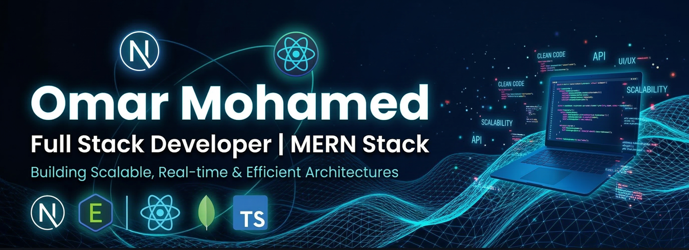

  

   
   

  <h2 align="center" style="color: #00e5ff;">Software Engineer | MERN Stack</h2>

  

    
    
    
    
  

---

### 👨‍💻 About Me

I'm **Omar Mohamed**, a Software Engineer passionate about building **complex, scalable web applications**. I specialize in the **MERN Stack** (MongoDB, Express, React, Node.js) with a deep focus on clean code, UI/UX, and robust architectures.

- 🔭 Currently building a full-stack **E-Learning Platform (LMS)** from scratch.
- 🌱 Deepening my knowledge in **Data Structures, Algorithms**, and Backend optimizations.
- 💡 Passionate about solving complex problems and delivering seamless user experiences.

---

### 🛠️ Tech Stack & Tools

**Frontend:** React, Vite, JavaScript, Tailwind CSS  
**Backend:** Node.js, Express, MongoDB, RESTful APIs  
**Tools:** Git, GitHub, Postman, Vercel

---
