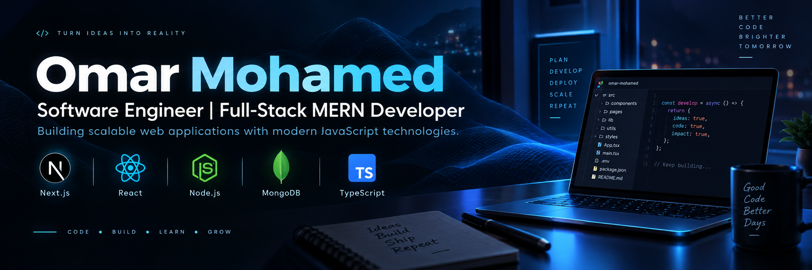

  

   
   

  <h2>Software Engineer | Full-Stack MERN Developer</h2>

  

    Building scalable web applications with modern JavaScript technologies.
  

  

    
    
    
    
  

---

## 👨‍💻 About Me

I'm **Omar Mohamed**, a Full-Stack Software Engineer specializing in building modern and scalable web applications using the **MERN Stack**.

I work across both frontend and backend development, transforming ideas into complete applications with responsive interfaces, secure APIs, authentication systems, dashboards, payment integrations, and maintainable architectures.

* 🚀 Building a full-stack **E-Learning Platform (LMS)** from scratch.
* ⚛️ Working with **React.js, Next.js, Tailwind CSS, and modern JavaScript**.
* ⚙️ Developing backend systems using **Node.js, Express.js, MongoDB, and REST APIs**.
* 🔐 Experienced with **Authentication, Authorization, Roles, Payments, Webhooks, and Media Management**.
* 🧠 Improving my knowledge of **Data Structures, Algorithms, Backend Architecture, and Performance Optimization**.
* 🎯 Focused on writing **clean, maintainable, and scalable code**.

---

## 🛠️ Tech Stack

### Frontend

  

### Backend

  

### Tools & Platforms

  

---

## 🚀 Currently Working On

### E-Learning Platform — LMS

A full-stack Learning Management System designed with real-world application architecture and scalable features.

**Main Features:**

* Authentication & Authorization
* Role-Based Access Control
* Student & Instructor Accounts
* Instructor Applications
* Admin Dashboard
* Course Management
* Media Management
* Orders & Payments
* Payment Webhooks
* Instructor Earnings
* Settlement Management

**Technologies:**
`React` • `Node.js` • `Express.js` • `MongoDB`

---

## 🌐 Connect With Me

